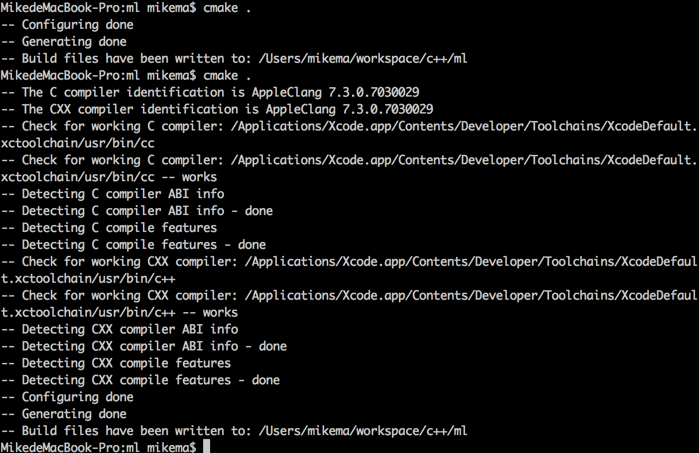

##MA Jiangfan 20089818

##The project contains serveral files as following:

* TrainingData.h		
* trainingData.txt
* main.cpp 

####files listed above are given and remain unchanged.

* Net.h

####file list above is given and modified.

* Net.cpp
* neuron.h
* CMakeList.txt

####files list above are created by author. 

##How to copmile 
####(The following instructions work on OS X 10.11)
To compile the project, please install cmake avalible at [cmake.org.](cmake.org) first (On OS X this step is down by using homebrew). Then follow the steps below in terminal:

1. switch current path to the project folder.
2. Type in "cmake ." then press enter to generate makefile and you will see the following:

3. Type in "make" then press enter to compile.
4. Now the excutable programm is generated. To run it, type "./assignment2" and press enter.

For other issues, plese read the code or contact the author at [jmaac@connect.ust.hk](mailto:jmaac@connect.ust.hk)